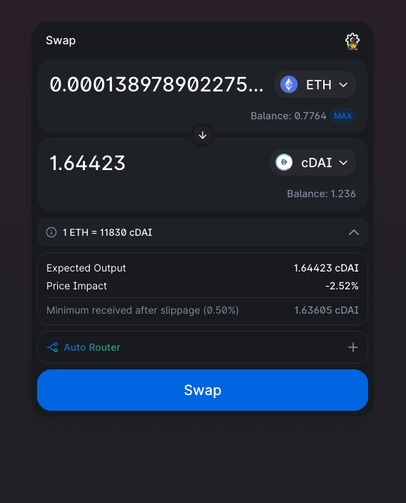

# Session 7

I think I figured it out. Got something that looks like a proper answer:

UniV2 buy (WETH-cDAI): For 138978902275227 WETH

UniV3 sell (cDAI-WETH): For 151816185482319 WETH

Profit: 12837283207092 WETH

Let's check.

BUY: https://goerli.etherscan.io/tx/0xd0cadee67decaabc4bc03327f339fa838955d1ea0118bd28f83507245c0a80cf
SELL: https://goerli.etherscan.io/tx/0xad7216acba3d34be5cb44c741290d8d67ed20a9699c14ce5cc9494c53e3cb78d

INPUT: 0.000138978902275227

OUTPUT: 0.000127422326641884

well, profit=-11556575633343 WETH

## Prices after:

V3: [ '0.0000866708' ]

V2:  [ '0.000077722' ]

That means that I bumped the price on V3 too much

Need to investigate on-chain and off-chain data, and probably change logic on final calculation.

I guess the buy amount on V3 pushed it to the last tick