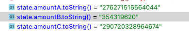

# Session 8

I found out that my code overwritte the last swap step `amountIn`,
which caused incorrect `amountA` computation.

Fixed it, and I think I got a clear result

https://goerli.etherscan.io/tx/0x9f50094d17167dbc1d2d85dc8cff4d67d07d920907f0f4d989ca91895cfd38db
https://goerli.etherscan.io/tx/0xc92ede02b49e9ea54e27dead0769fff8d3aed93e0016b48d78c3cc493890bb99

### Swap 1:
**SELL:** 0.000276271515564044 WETH

**BUY:** 3.5431962 cDAI

### Swap 2:
**SELL:** 3.5431962 WETH

**BUY:** 0.0002907203292578600 cDAI

### Results
**Calculated profit**: 0,000014448813400630 WETH

**Real profit**: 0,000014448813693816 WETH

**Real profit is bigger than calculated by 293,186 wei**

### NOTE

I guess that little difference is because of newton sqrt calculation.

Need to check how `bignumber.js` handles sqrt, and if it's precise enough,
use it as an arbitrary

### UPDATE
The bug was in incorrect tick

However though. something is probably wrong with `swapToPriceMath`.

why the fuck it looks like that exactInput and zeroForOne are dependant???

